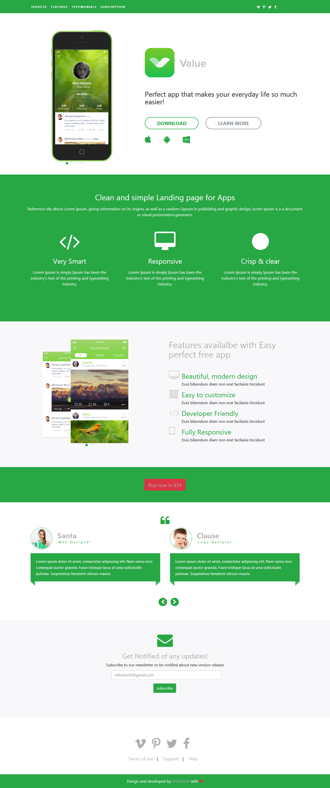

# PresideCMS Extension: Value App Preside Theme



This is a free Preside CMS Theme. You can use this theme for your website or use it as a reference for developing a Preside theme. The theme will show you the basic concept of Preside CMS, how to create objects, how to overwrite templates and etc. It's really a good starter template for the beginners.

## Installation

Install the extension to your application via either of the methods detailed below (Git submodule / CommandBox) and then enable the extension by opening up the Preside developer console and entering:

    extension enable preside-theme-valueapp
    reload all

## How it works

The extension is a free Preside Theme, once this installed you can now have a freedom to configure the template same as you see on this link https://bootsnipp.com/fullscreen/35jBD. The theme has a different available widgets for you to customize the website, feature list and service list. Also, You can configure everything on the template from text on the logo to footer links and social media icons, you can do that via Preside Global Settings.

	widgets:
	=======
		- Feature list 		: Used for adding features like feature icon, name and description.
		- Service list 		: Used to add the services same as features details like service icon, name and description.
		- page render 		: include the page in homepage.
		- form builder 		: used to select the form and layout for form builder.

	page types:
	==========
		- services			: Adding for services and service list widgets
		- features			: used for features and feature list widgets
		- testimonials		: Used to add author details.In that, we add author using object picker.(first we create data manager for that)
		- subscription		: user allow to do subscription.

	Note: header and footer also contains some social icons so we need to create data manager.

## Setup

```
User can choose any of the widgets mentioned above from the widget picker in ckeditor.
```


Selecting  any widget will display all details related to the widget in user friendly manner, user can fill them. So, the details will be rendered in user side.

~~~
To use App store icons, social networks and testimonials, first the user has to provide contents in the Data manager.
~~~


~~~
Also user can make use of Preside's form builder, It will get rendered in user side.
~~~


### Git Submodule method

From the root of your application, type the following command:

	git submodule add https://github.com/cfmitrah/preside-theme-valueapp.git application/extensions/preside-theme-valueapp

### CommandBox (box.json) method

From the extension folder of your application, type the following command:

    box install cfmitrah/preside-theme-valueapp